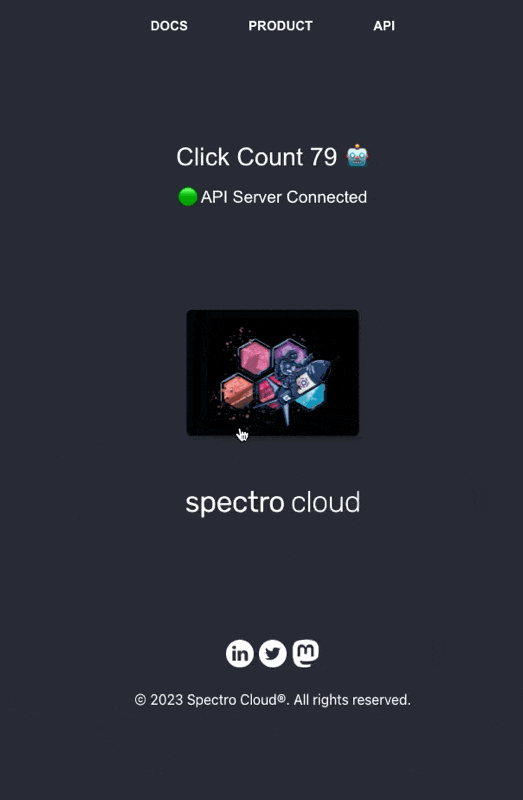

# Hello Universe

Hello Universe is a demo application intended for learning about [Palette](https://docs.spectrocloud.com/introduction) and to help showcase product features.

<p align="center">

</p>

## Start App

Get started with Hello Universe by choosing between two deployment approaches; docker or a non-docker-based approach.

### Docker

Hello Universe is available as a Docker image.
To run Hello Universe issue the following commands:

```shell
docker pull ghcr.io/spectrocloud/hello-universe:1.1.0
docker run -p 8080:8080 ghcr.io/spectrocloud/hello-universe:1.1.0
```

### Non-Docker

To run locally without Docker:

```
git clone git@github.com:spectrocloud/hello-universe.git
npm ci
npm run start
```

### Environment Variables

Hello Universe accepts the following environment variables:

| Variable    | Description                                                                                                                   | Default |
| ----------- | ----------------------------------------------------------------------------------------------------------------------------- | ------- |
| API_URI     | The fully qualified hostname and port of the API server. In a reverse proxy setting this can be the application loadbalancer. | `""`    |
| API_VERSION | The API version number.                                                                                                       | `1`     |
| SVC_URI     | The URI to the service API, such as the internal Kubernetes container hostname of the API service.                            | `""`    |
| TOKEN       | The API authorization token. This is only used if the API is configured for authorization.                                    | `""`    |

### Connecting to API Server

Hello Universe's capabilities can be expanded if connected to the [Hello Universe API](https://github.com/spectrocloud/hello-universe-api).
To connect Hello Universe to the API server, provide the API server's fully qualified hostname and port as an environment variable value.
Be aware that the API server requires an available Postgres database. Checkout [Hello Universe DB](https://github.com/spectrocloud/hello-universe-db) for a dockerized Postgres instance ready for integration with the Hello Universe API.

```shell
API_URI=http://localhost:3000
```

If you are using the Docker image then use the `-e` flag parameter.

```shell
docker run -p 8080:8080 -e API_URI=http://localhost:3000 ghcr.io/spectrocloud/hello-universe:1.1.0
```

### Reverse Proxy

A Docker container with a reverse proxy is available. The reverse proxy is usefull for scenarios when you need to deploy the
hello universe application into a Kubernetes cluster or similar architectures and need the UI to route requests internal to the hosting platform. An example of such behavior is needing to to reach a private API inside the Kubernetes cluster. **The reverse proxy expects the API to be listening on port `3000`.**

```shell
docker run -p 8080:8080 -p 3000:3000  -e SVC_URI="http://myprivate.api.address.example:3000" -e API_URI="http://myloadbalancer.example:3000"  ghcr.io/spectrocloud/hello-universe:1.1.0-proxy
```

#### Reverse Proxy Environment Variables

| Variable        | Description                                                                                                                                                                             | Default |
| --------------- | --------------------------------------------------------------------------------------------------------------------------------------------------------------------------------------- | ------- |
| `SVC_URI`       | The URI to the service API, such as the internal Kubernetes container hostname of the API service.                                                                                      | `""`    |
| `API_URI`       | The fully qualified hostname and port of the API server. In a reverse proxy setting, set this to the service loadbalancer. If `QUERY_K8S_API` set to `true`, leve this parameter empty. | `""`    |
| `TOKEN`         | The API authorization token. This is only used if the API is configured for authorization.                                                                                              | `""`    |
| `QUERY_K8S_API` | Set to `true` to query the Kubernetes API for the service hostname. This is useful when the service is deployed in a Kubernetes cluster.                                                | `false` |

#### Reverse Proxy with Kubernetes

To deploy the Hello Universe application into a Kubernetes cluster, use the deployment manifest in `deployments/k8s.yaml`. Ensure you provide values and update all placeholders in the manifest with the value `<REPLACE_ME>`. The values must be in base64 format.

When deploying the Hello Universe application into a Kubernetes cluster, set the `QUERY_K8S_API` environment variable to `true` and set the `API_URI` environment variable to an empty string. This will result in the reverse proxy forwarding API requests to API service. Only a single load balancer is used in the Kubernetes deployment. If authorization is enabled, provide the `auth-token` Kubernetes secret with the API authorization token value. Otherwise, API will fail to authorize requests.

> [!NOTE]
> The `QUERY_K8S_API` environment variable is only used when deploying the Hello Universe application into a Kubernetes cluster. Enabling this environment variable will query the Kubernetes API for the service hostname. You can review the script in the `scripts/service-ip.sh`.


Inside the Hello Universe container, [Caddy](https://caddyserver.com/) is used as a reverse proxy to route requests to the API server. The API server is expected to be listening on port `3000`.

If the Hello Universe API is enabled for authorization, provide the `TOKEN` environment variable with the API authorization token. The default anonymous token is `"931A3B02-8DCC-543F-A1B2-69423D1A0B94"`. The reverse proxy will include the token when forwarding requests to the API server.

> ![TIP]
> If you want to automatically inject the authorization token into the reverse proxy for all API requests, uncomment line 29 in the Caddyfile under **/etc/caddy/**.
> ```header_up Authorization "Bearer {$TOKEN}"```
> Issue the command `caddy reload --config /etc/caddy/Caddyfile` to apply the changes.

## Image Verification

We sign our images through [Cosign](https://docs.sigstore.dev/signing/quickstart/). Review the [Image Verification](./docs/image-verification.md) page to learn more.

## Development

Create an environment file `.env` file and add the following values:

```
REACT_APP_API_URI=http://localhost:3000
REACT_APP_API_VERSION=1
```

The `.env` file is how you point to the local development API server. Otherwise, local browser storage is used.

Use the [`docker-compose.yml`](./docker-compose.yml) to start the required services.

```shell
make start-services
```

Next, start the local development server

```shell
make start
```

To stop the docker containers, use the following command.

```shell
 make stop-services
```

## Clean

To remove the build folder use the command `make clean`

## Build

To build the hosting assets use the command `make build`

### Development Server

To start the local development server without a proxy use the command `make start`.

### Server w/o Reverse Proxy

To start the Caddy server without a reverse proxy use the command `make start-prod`.

### Server w/o Reverse Proxy

To start the Caddy server with a reverse proxy use the command `make start-proxy`.

## Dependencies

- [Caddy](https://caddyserver.com/docs/)
- [React Spring](https://github.com/pmndrs/react-spring) is used to animate the logo.
